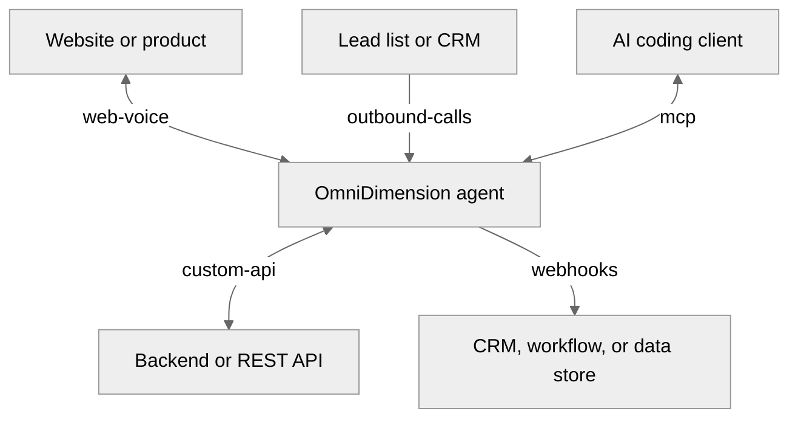

<table>
  <tr>
    <td align="center" bgcolor="#101312">
      
    </td>
  </tr>
</table>

<h1 align="center">OmniDimension examples</h1>

Reference implementations for connecting voice agents to the systems you already use.

  
  
  
  
  
  
  

## New to OmniDimension?

Start with the [developer documentation](https://docs.omnidim.io/docs), then use
the [Web SDK guide](https://docs.omnidim.io/docs/sdks/web), [API
reference](https://docs.omnidim.io/docs/api-reference), and [video
tutorials](https://www.youtube.com/@OmniDimensionio) as you adapt an example.

## Start with a safe local run

1. Choose an integration pattern below.
2. Follow its README and run the included fixture, dry run, or local simulation.
3. Add your OmniDimension credentials only when you are ready to make a live connection.

No example makes a live call by default.

## Integration patterns

<table>
  <tr>
    <td width="50%" valign="top">
      <a href="./web-voice"><strong>Embed voice in your product</strong></a> 
      Add browser calls, live transcripts, mute, and hang-up controls.  
      <a href="./web-voice">Open web voice →</a>
    </td>
    <td width="50%" valign="top">
      <a href="./custom-api"><strong>Connect the agent to your backend</strong></a> 
      Let an agent look up data or take an approved action through your API.  
      <a href="./custom-api">Open custom API →</a>
    </td>
  </tr>
  <tr>
    <td width="50%" valign="top">
      <a href="./outbound-calls"><strong>Run outbound calls from your data</strong></a> 
      Validate a lead list, review a dry run, then dispatch a campaign.  
      <a href="./outbound-calls">Open outbound calls →</a>
    </td>
    <td width="50%" valign="top">
      <a href="./webhooks"><strong>Receive completed-call outcomes</strong></a> 
      Deliver summaries and extracted data to a workflow you control.  
      <a href="./webhooks">Open webhooks →</a>
    </td>
  </tr>
</table>

## Developer tooling

<table>
  <tr>
    <td width="50%" valign="top">
      <a href="./mcp"><strong>Manage agents from your coding client</strong></a> 
      Connect OmniDimension to Claude Code, Codex, Cursor, or VS Code.  
      <a href="./mcp">Open MCP →</a>
    </td>
    <td width="50%" valign="top">
      <a href="https://discord.gg/kdjzykMTHJ"><strong>Talk to the builders ↗</strong></a> 
      Get unstuck, compare approaches, and share what you are shipping.  
      <a href="https://discord.gg/kdjzykMTHJ">Join our Discord community ↗</a>
    </td>
  </tr>
</table>

## How the examples fit together

Every example is small enough to understand in one sitting and structured so
you can replace the sample data and endpoints with your own systems.

## Documentation and community

- [Developer documentation](https://docs.omnidim.io/docs)
- [Video tutorials](https://docs.omnidim.io/docs/tutorials)
- [Report a bug](https://github.com/Omnidim/examples/issues)
- [Join our Discord community ↗](https://discord.gg/kdjzykMTHJ) for build questions, discussion, and sharing what you ship.

## Development

Examples are intentionally independent. Change into the directory you want to
run and follow its README. TypeScript examples use npm. Python examples use
Python 3.10 or later and can be run in a virtual environment.

Before opening a pull request, run the checks listed in the example you
changed. Continuous integration runs the repository-wide smoke checks.

## Contributing

Read [CONTRIBUTING.md](./CONTRIBUTING.md) before submitting a change. We welcome
fixes, documentation improvements, and examples that demonstrate a broadly
useful integration pattern.

## Security

Do not include API keys, call recordings, customer data, or internal URLs in
issues or pull requests. See [SECURITY.md](./SECURITY.md) for reporting details.
