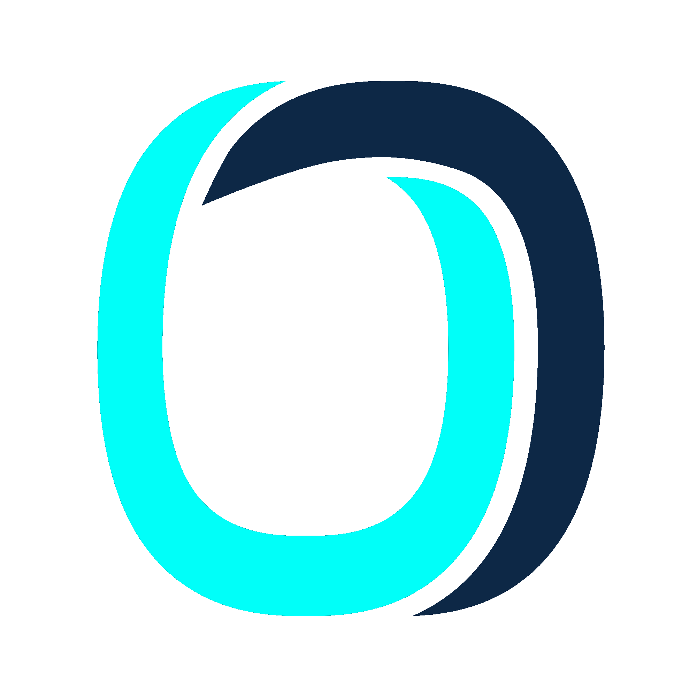
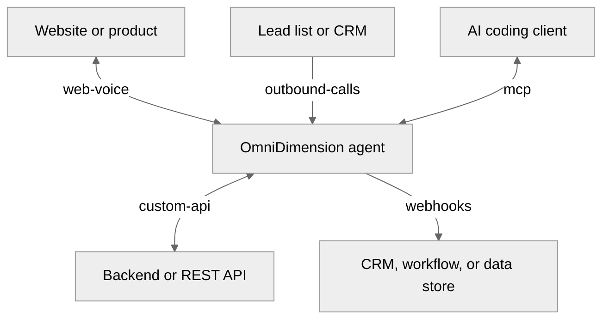

  <a href="https://omnidim.io">
    <picture>
      <source media="(prefers-color-scheme: dark)" srcset="./assets/omnidim-icon-dark.png">
      <source media="(prefers-color-scheme: light)" srcset="./assets/omnidim-icon-light.png">
      
    </picture>
  </a>

<h1 align="center">OmniDimension examples</h1>

Reference implementations for connecting voice agents to the systems you already use.

  
  
  

## Integration patterns

<table>
  <tr>
    <td width="50%" valign="top">
      <a href="./web-voice"><strong>Embed voice in your product</strong></a> 
      Add browser calls, live transcripts, mute, and hang-up controls.
    </td>
    <td width="50%" valign="top">
      <a href="./custom-api"><strong>Connect the agent to your backend</strong></a> 
      Let an agent look up data or take an approved action through your API.
    </td>
  </tr>
  <tr>
    <td width="50%" valign="top">
      <a href="./outbound-calls"><strong>Run outbound calls from your data</strong></a> 
      Validate a lead list, review a dry run, then dispatch a campaign.
    </td>
    <td width="50%" valign="top">
      <a href="./webhooks"><strong>Receive completed-call outcomes</strong></a> 
      Deliver summaries and extracted data to a workflow you control.
    </td>
  </tr>
</table>

## Developer tooling

<table>
  <tr>
    <td width="50%" valign="top">
      <a href="./mcp"><strong>Manage agents from your coding client</strong></a> 
      Connect OmniDimension to Claude Code, Codex, Cursor, or VS Code.
    </td>
    <td width="50%" valign="top">
      <a href="https://n8n.io/integrations/omnidimension-trigger/"><strong>Build it without code ↗</strong></a> 
      Our verified n8n node runs calls and reacts to them from a workflow editor.
    </td>
  </tr>
</table>

## How they fit together

## Contributing

See [CONTRIBUTING.md](./CONTRIBUTING.md). Never put API keys, recordings, or
customer data in an issue or pull request. [SECURITY.md](./SECURITY.md) covers
reporting a vulnerability.
